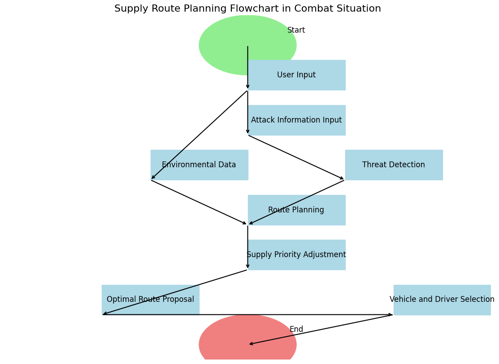

# supply-route-sim

> **Archived project (Sep–Oct 2024).** Kept as-is; the notebooks reflect what I knew at the time and are no longer maintained.

Supply route planning experiments: the same problem — getting supplies from a depot to units while avoiding threat zones — attacked three different ways: reinforcement learning on a gridworld, classical optimization with OR-Tools (CVRP), and an interactive GUI/map simulator.

These notebooks were the exploratory work behind an entry for the 2024 1st Defense AI Ideathon (제1회 국방 AI 아이디어톤). The planning document behind them is summarized in [`docs/proposal-summary.md`](docs/proposal-summary.md); this repo is the code side of that effort.

## Repository structure

```
notebooks/   original Colab notebooks (unchanged)
src/
  supply_sim/
    gridworld_qlearning.py   tabular Q-learning (5x5 trap grid, 4x4 grid)
    gym_env.py               custom gym GridEnv + PPO training
    cvrp.py                  OR-Tools CVRP model + solver
    route_map.py             folium route-comparison map builder
    flowchart.py             matplotlib supply-planning flowchart
    entities.py              soldier/vehicle/building stat model, from the
                             planning document rather than a notebook
scripts/     thin argparse CLIs calling src/ (run_qlearning, run_ppo,
             solve_cvrp, build_route_map, draw_flowchart)
docs/        original Korean README + extracted outputs + proposal summary
  proposal-code/  every other code block from the planning document,
                  verbatim and unrun — design sketches, not run code
```

The notebooks are the original Colab experiments; `src/` is the same code extracted into importable modules (Colab-specific `!pip` cells removed, logic unchanged). The tkinter GUI (`logistics_sim_tkinter_*`) stays notebook-only because it is an interactive desktop GUI, not a library-shaped flow.

Two things in the tree did **not** come from a notebook: `src/supply_sim/entities.py` and everything under `docs/proposal-code/`. Those are the Python the planning document itself carried, kept separate so it is never mistaken for code that ran — see [`docs/proposal-code/README.md`](docs/proposal-code/README.md).

## Motivation

The problem comes from my military service: planning supply runs when parts of the map are effectively off-limits. Everything here is a **synthetic scenario** — the maps use arbitrary points in downtown Seoul as stand-ins, and no real military data, facility locations, or routes appear anywhere.

The planning document ([summary](docs/proposal-summary.md)) started as a brainstorming list of unrelated defense-AI ideas and converged on one: a supply-distribution optimizer that runs in two modes, peacetime and wartime. The argument in it is budgetary rather than tactical — some items get over-ordered while things actually needed arrive late, and manual planning degrades exactly when the situation stops being predictable. The proposed system was six pieces: an interactive map UI where a reporter pins an incident and that incident becomes a routing obstacle; an RL route model weighted by terrain, weather, travel time and contamination; a supervised (Random Forest) demand forecaster driving peacetime stocking; an RL priority-weighting model that reorders supply classes by situation (ammunition in wartime, food and clothing in peacetime, medical after a strike); a soldier/vehicle/building stat simulation that generates the demand numbers; and a vehicle-and-driver assignment step constrained by how many drivers exist.

The notebooks are prototypes of three of those pieces:

| Proposal component | Prototyped by |
|---|---|
| RL route model — learn to route around threat zones (Q-learning / DQN / PPO are all named in the document) | `rl_gridworld_qlearning_ppo.ipynb`: tabular Q-learning on a grid with a trap cell, then PPO on a custom `gym.Env`. The trap cell is the threat zone, reduced to its smallest form. |
| Vehicle and driver assignment — match cargo to vehicles, respect capacity, stagger runs | `ortools_cvrp_supply_routing.ipynb`: CVRP with 2 capacity-3 vehicles over 5 delivery points. Covers the capacity/assignment half; the driver-license priority rule is not modeled. |
| Interactive UI + soldier stat simulation + before/after threat re-routing | `logistics_sim_tkinter_v1.ipynb` (soldier hunger/health/stress/hygiene against supply stocks — the document's four stat names, though not its mechanics; see below), `logistics_sim_tkinter_folium_v2.ipynb` (buildings and threats on a folium map), `folium_route_comparison_map.ipynb` (the trained-vs-untrained route figure the document describes). |
| Situation-dependent supply priority (which class ships first) | `combat_supply_flowchart.ipynb` — only as a diagram of the decision process, not as a model. |

The proposal did not stop at describing the stat simulation — it wrote the classes out, and that code is now in the repo at [`src/supply_sim/entities.py`](src/supply_sim/entities.py): `Soldier` with hunger/health/stress/hygiene, `Vehicle` with durability/capacity/fuel, `Building` with durability, each with an `update_stats()` decay tick and an `apply_supply(supply_type)` that dispatches on the Korean supply class number (1 food, 2 bedding/clothing, 3 fuel, 4 construction materials, 5 ammunition, 8 medical, 9 repair parts).

The tkinter simulator implements a **reduced** version of that model rather than the model itself. Its `Soldier` reuses the same four stat names but takes them as constructor arguments alongside a `name`, and its only supply behaviour is `consume_supply()`, which tops up hunger from a food `Supply`. There is no per-tick decay, no dispatch on supply class, and no `Vehicle` or `Building` class at all — buildings in the notebook are `(x, y)` tuples drawn on a canvas. So the vocabulary carried over into the simulator; the decay-and-resupply mechanics, which is what would have produced demand numbers, did not.

The rest of the document's code — a positional revision of the entity classes, three driver loops, two PPO route environments, a `DisasterEnvironment` skeleton, a Keras DQN agent, and a 10×10 grid `MilitaryEnv` — is preserved verbatim and unrun in [`docs/proposal-code/`](docs/proposal-code/), with a per-file note on what is missing from each.

### What was never built

Being plain about it, most of the proposal exists only on paper:

- **DELLIS / DTIS integration** — the whole "read real consumption and mileage records" premise. No integration, no API, no data.
- **Consumable-lifetime and failure-risk prediction** ("warn which parts are due, flag emerging risks"). Nothing here predicts anything about a vehicle.
- **Random Forest demand forecasting.** No supervised model was ever trained; there was no consumption dataset to train it on.
- **Damage-report ingestion.** The document's own open question — how a damage report actually reaches the system — was never answered beyond "through the UI". Threats in the notebooks are hardcoded.
- **Soldier-stat-driven demand feeding the router.** The full stat model exists only as the proposal's own unrun code (`src/supply_sim/entities.py`); the tkinter sim tracks a reduced version of the stats, and its consumption never becomes input to the CVRP or RL side.
- **A DQN of any kind.** The document sketches two (`docs/proposal-code/08`, `10`) and names DQN throughout; no notebook implements one. The RL work here is tabular Q-learning and PPO.
- **The layered military map** (terrain, transport network by road surface, CBRN, weather, buildings) and the dynamic-shortest-path recompute with caching. The maps here are a handful of markers and circles.
- **Everything wartime beyond a threat circle**: the graded contamination model with wind, the close/ranged/area weapon damage bands.

## Three approaches to one problem

| Approach | Notebook | Idea |
|---|---|---|
| Reinforcement learning | `notebooks/rl_gridworld_qlearning_ppo.ipynb` | Tabular Q-learning on 5×5 (with a trap cell) and 4×4 grids, then PPO (stable-baselines3, 10,000 timesteps) on a custom `gym.Env` for the same 4×4 grid |
| Classical optimization | `notebooks/ortools_cvrp_supply_routing.ipynb` | Capacitated vehicle routing: 1 depot + 5 delivery points, 2 vehicles of capacity 3, Euclidean distances |
| Simulation / visualization | `notebooks/logistics_sim_tkinter_v1.ipynb` → `notebooks/logistics_sim_tkinter_folium_v2.ipynb` → `notebooks/folium_route_comparison_map.ipynb` | v1: tkinter GUI managing soldiers' hunger/health/stress/hygiene against supply stocks; v2: adds a folium map of buildings and threats; final: folium map comparing a "low-learning" route (skirts a missile-threat circle) vs a "high-learning" route (fully avoids it) |

The OR-Tools solver produces (from the notebook output):

```
Objective: 50
Vehicle 0: 0 -> 3 -> 4 -> 0  (distance 23)
Vehicle 1: 0 -> 1 -> 5 -> 2 -> 0  (distance 27)
```

The RL notebooks show the learned Q-tables converging toward the goal cell; no quantitative benchmark beyond that was recorded.

## Screenshots

Supply-decision flowchart rendered by `notebooks/combat_supply_flowchart.ipynb`:



The route-comparison map is interactive folium output — open [`docs/folium_route_comparison.html`](docs/folium_route_comparison.html) in a browser (extracted from the notebook output). It shows three facility markers, two threat circles, and the two routes (blue = early training, green = trained).

## Notebook index

| File | Purpose |
|---|---|
| `notebooks/rl_gridworld_qlearning_ppo.ipynb` | Q-learning (5×5 and 4×4 grids) + PPO on a custom gym environment |
| `notebooks/ortools_cvrp_supply_routing.ipynb` | OR-Tools CVRP for supply vehicle routing |
| `notebooks/combat_supply_flowchart.ipynb` | matplotlib flowchart of the supply-planning decision process |
| `notebooks/logistics_sim_tkinter_v1.ipynb` | tkinter GUI simulator v1 (soldier stats vs supply stocks) |
| `notebooks/logistics_sim_tkinter_folium_v2.ipynb` | v2: tkinter GUI + folium map of buildings/threats |
| `notebooks/folium_route_comparison_map.ipynb` | folium map comparing low- vs high-training routes around threat zones |

## Running

The RL, CVRP, and flowchart notebooks run directly in Colab (`!pip install ortools` / `stable-baselines3` cells included). The tkinter notebooks need a display: v1 includes an `xvfb`/`pyvirtualdisplay` setup for Colab, but the GUI is really meant to be run locally with a desktop Python; `notebooks/logistics_sim_tkinter_folium_v2.ipynb` also calls `os.startfile`, which is Windows-only — expect it not to work in Colab as-is.

```
pip install -r requirements.txt
```

## What I'd do differently

The three tracks never actually meet: the RL agent lives on an abstract grid, the CVRP solver on abstract coordinates, and the folium "learning comparison" routes are hand-drawn to illustrate the idea rather than produced by the trained agent. Today I would project the gridworld onto the map's coordinate frame so the plotted routes come straight from the Q-table/PPO policy, log a proper training curve instead of eyeballing Q-tables, and encode threat zones as costs in the CVRP distance matrix so the two solvers become directly comparable on one scenario.

## Provenance

These were Colab notebooks organized and renamed later; original names and dates below. Work period: **Sep 15 – Oct 2, 2024**. The original Korean README is preserved at [`docs/README.ko.md`](docs/README.ko.md).

| File | Original name | Date |
|---|---|---|
| `notebooks/rl_gridworld_qlearning_ppo.ipynb` | A/Untitled0.ipynb | 2024-09-15 |
| `notebooks/ortools_cvrp_supply_routing.ipynb` | A/Untitled1.ipynb | 2024-09-29 |
| `notebooks/combat_supply_flowchart.ipynb` | A/Untitled2.ipynb | 2024-09-29 |
| `notebooks/logistics_sim_tkinter_v1.ipynb` | A/Untitled3.ipynb | 2024-09-29 |
| `notebooks/logistics_sim_tkinter_folium_v2.ipynb` | A/Untitled4.ipynb | 2024-09-29 |
| `notebooks/folium_route_comparison_map.ipynb` | A/Untitled5.ipynb | 2024-10-02 |

## License

MIT — see [LICENSE](LICENSE).
